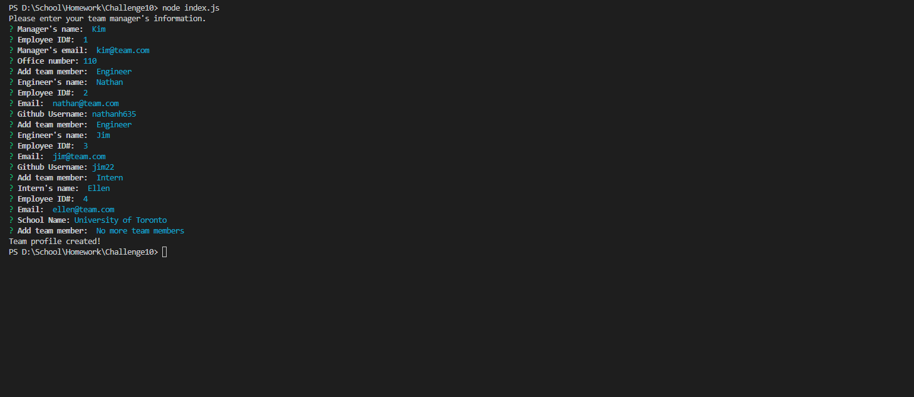
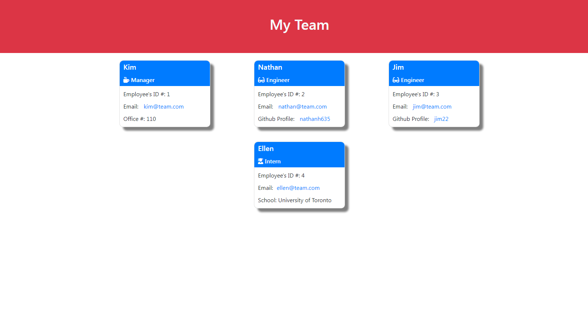

# Team Profile Generator
  

  ## Description

  The project is designed to generate a team profile HTML document based on user provided inputs.

  Some features of the program:
  -  When the project is run, it will accept user input for a manager for the team.
  -  Once the manager has been entered, it will open a menu to add additional engineers or interns to the team, or complete the team.
  -  Additional engineers and interns can continue to be added to the team, and once their information is added, the program will return to the menu to add team members.
  -  When no more team members need to be added, an index.hteml document will be generated in the /dist folder containing the team profile.
  -  If an entered ID number matches an existing ID number, the console will identify the error, and the user will be returned to the "Add Team Member" menu with no changes having been made.
  -  The tests in the test folder test the classes for initialization and for each of the methods to ensure that everything works as intended.
  -  Limitations were placed on the name parameter in the employee class to ensure that a string of characters were used; however, as it's feasible to imagine that employee numbers and office numbers may include letters (i.e., office 101B, etc.), such limitations were not included for these parameters.
  -  Emails entered must be in the appropriate format; otherwise they will throw an error.

## Table of Contents

- [Installation](#installation)
- [Usage](#usage)
- [License](#License)
- [Contributing](#contributing)
- [Tests](#tests)
- [Questions](#questions)
- [Screenshots](#screenshots)
- [Links](#links)

  ## Installation

  Requires inquirer module to run, and Jest module for testing.

  ## Usage

  run program using node index.js after running npm init and npm install for inquirer and jest.

  ## License

  This project is licensed under the GNU GPLv3 license. Read more about the license here:
  https://choosealicense.com/licenses/gpl-3.0/
  

  ## Contributing

  Please fork and submit a pull request.

  ## Tests

  Use the Jest module, and run the tests for the classes in the "__tests__" folder.

  ## Questions

  You can reach me at GitHub; my username is nathanh635 and my profile is here: https://github.com/nathanh635. 
  You can also email me at nathanh635@gmail.com. 
  
  ## Screenshots

  Below are some screenshots of the application running and the generated README.md file. The example readme is also available as "./exampleREADME.md".

  
## Links

  Repository: https://github.com/nathanh635/README-Generator
  Video Walkthrough: https://drive.google.com/drive/folders/1EgsL4t-Exp1ZUehaEIwEXGDr-bvPiE7_?usp=sharing

